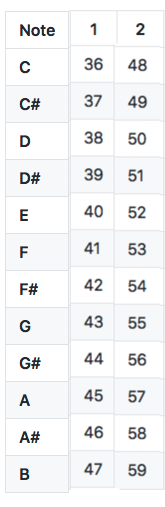

# MIDI - Madmapper, Ableton and More 

### MIDI Node/Arduino Table

 

noteOn(0, 50, 64); //note D2
noteOn(0, 52, 64); //C2
noteOn(0, 48, 64); //E2

### View the code and Serial Monitor data

1. Find "[MIDI-timed](MIDI-timed)" on this Github page (open in a new tab)
- copy-paste/fork/download this code
- Upload this code to your Arduino board
- Open Serial Monitor (Search icon right top)
- Your serial monitor will now be in the IDE, always open this when working with arduino!
- Check the values in the Serial Monitor, try to understand the code

### View the MIDI data from the arduino 
1. Download MIDI View: https://hautetechnique.com/midi/midiview/
- Open MidiView 
- Click Enable, and Select Arduino Micro 
- You should see the MIDI data in MidiView

### Interactive MIDI using the distance sensor 
1. Copy/download/fork the code from:[MIDI-distance_NoteOn](MIDI-distance_NoteOn)
- Follow instructions in this code how to connect your Distance sensor
- check [readme.rm](readme.rm) to see the board connections
- Upload the code en check the data in the Serial Monitor (Arduino)  
- Check if data is received by MidiView  

## Control Madmapper with distance sensor (Arduino) 
1. Make two scenes (Dropdown: Scenes/ Cues 
- Select > Right click
- Add Controll > MIDI
- Learn button
- Back to Dropdown: Scenes/ Cues
- Select a scene 
- Trigger the MIDI input for this Scene
- Repeat for the second scene

In video:

[https://vimeo.com/videos/753106105](Attaching MIDI controls to Madmapper)

💡🚀TIP: If you want to test what switching between scenes looks like, before you do all the MIDI settings. Use your keyboard to fake the interaction for testing. Then instead of MIDI, choose Keyboard 

# Make Ableton interactive - Using external sensors 
How it works: Sensor -> MICRO-> Seeeduino -> MIDI -> Ableton 

### Ableton MIDI settings 
1. Live > Preferences > Link/tempo/MIDI 
- in the 'MIDI ports' section:  
	- select Micro: Track and Remote

**Check if MIDI Is received by Ableton 
**
In the top, on the far right, two squares next to each other. You see the yellow block light up very briefly at MIDI input.

Video explaning (DUTCH only!) how to connect MIDI input to Ableton: [https://youtu.be/XS0JlHeDmTY?t=176]()
Code is a bit different from the code we use now

All Code examples: 
https://github.com/harmsel/ImmersiveEnvironments 
