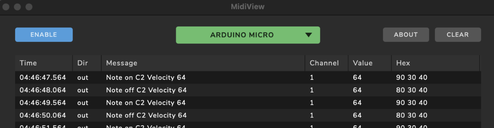

# MIDI - Madmapper, Ableton and More 

### MIDI Node/Arduino chart (you need this later) 
[https://diymidicontroller.com/midi-note-chart/ ]()

### View the code and Serial Monitor data

1. Find "MIDI-timed" on this Github page (open new tab)
- Upload
- Open Serial Monitor (Search icon right top)
- Your serial monitor will now be in the IDE, always open this when working with arduino

### View the MIDI communication 
1. Download MIDI View: [https://hautetechnique.com/midi/midiview/
](https://vimeo.com/753106105)
- Open MidiView 
- Click Enable, and Select Arduino Micro 
- You should be able to see the notes  de MidiView

### Generate MIDI using the distance sensor 
1. Copy/download/fork the code from:[MIDI-distance_NoteOn](https://github.com/harmsel/ImmersiveEnvironments/tree/main/MIDI-distance_NoteOn)
- Follow instructions in this code how to connect your Distance sensor
- Upload the code en check the data in the Serial Monitor (Arduino)  
- Check if data is received by MidiView  

## Control Madmapper with distance sensor (Arduino) 
1. Make two scenes (Dropdown: Scenes/ Cues 
2. Attach a MIDI controll to start each scene (dropdown: controll list) > Learn MIDI 
3. Go to Scenes/ Cues > select a scene 
4 Tigger a MIDI note ON (arduino) 
* Edit MIDI (in Control list) 

Attaching MIDI controls to Madmapper
https://vimeo.com/753106105

💡🚀TIP: If you want to test what switching between scenes looks like. Then use your keyboard to fake the interaction for testing. Then instead of MIDI, choose Keyboard 

# Make Ableton interactive - Using external sensors 
How it works: Sensor -> MICRO-> Seeeduino -> MIDI -> Ableton 

### Ableton MIDI settings 
1. Live > Preferences > Link/tempo/MIDI 
- in the 'MIDI ports' section:  
	- select Micro: Track and Remote

**Check if MIDI Is received by Ableton 
**
In the top, on the far right, two squares next to each other. You see the yellow block light up very briefly at MIDI input.

Video explaning (DUTCH only!) how to connect MIDI input to Ableton: [https://youtu.be/XS0JlHeDmTY?t=176]()
Code is a bit different from the code we use now

All Code examples: 
https://github.com/harmsel/ImmersiveEnvironments 
