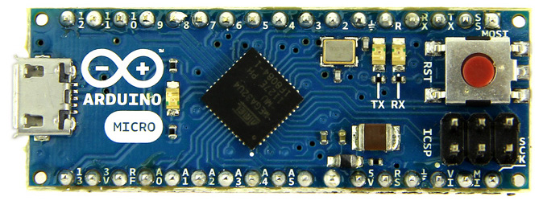

## Quickstart Arduino Mac (& Windows)  
### install Arduino Software 
Download and install Arduino IDE (not the online IDE/web editor) https://www.arduino.cc/en/Main/Software 
MAC: Move the file  ‘Arduino’ to ‘Apps’  
Start Arduino from Applications  

### Set UI to Englisch 
* To be more inline with documentation here and online 
* Go to 'Arduino' → ' Preferences  
* Pick “Editor language:” use ‘english’ 
* Connect board (USB cable)
* select board: Arduino MICRO from the dropdown. You should see the port: /dev/cu.usbmodem*** or simular (Windows = Com port) 

### Upload your code
* File → examples→ Basic → Blink 
* Compile and upload: you can use  ‘Command - U'  
* If you see 'Done uploading' it worked!  

### ADJUST the Blink code 
* The blue led on the board is blinking (1 second/1 second) 
* Change the frequency of the blinking led in the code, upload again. Can you see the difference?  

### Connecting sensors & Actuators

## Install/remove a Library  
* Arduino → Tools > Manage Libraries -> Search for “name of the lib” 
* Remove: Go to 'Arduino' → ' Preferences . You will find the 'Sketchbook location' Open en find the location of the Libraries
* Remove (delete) using finder. Normaly are the libs in Documents/Arduino/Libraries

## Fixing errors
There are two kinds of errors:

1. USB/port problems (this is 'normal' 😫)
2. Errors in code

#### USB/port problem or Code error?

1. Unplug all sensors (or the ground wire to the sensors)
- Upload an empy sketch (press command+n) and (command+u). 
- Still an error while uploading? **= USB/port problem**

#### USB/port problem - Fix
1. Don't try to upload if the Board and port are not selected (Like image below) it is useless and thus frustrating
- Press the button on the Micro (LED starts fading in/out)
- Wait till fading stops
- Select the board and select the port (in the Arduino IDE)
	1. Board and Port not visible in the dropdown? 
		- Use another (physical) USB port on your laptop, use another cable, try another Arduino
- Upload again 🤞

This is what we would like to see (port name could be a bit different. Windows = Com#)

    

    