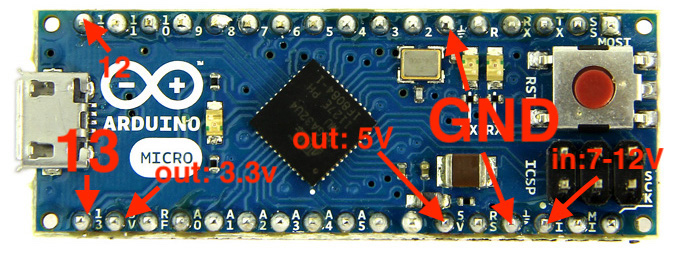

# Immersive Environments docs 
* [Quickstart: install en first test] (#quickstart)
* [Connect sensors](### Connecting sensors & Actuators)
* [Library install and removal](## Install/remove a Library)
* [Fixing errors](## Fixing errors)
* [Make Madmapper & Ableton interactive using sensors](MIDI-Madmapper.md)
\

[Go to Real Cool Heading section](#quickstart)

##  Quickstart Arduino Mac (& Windows)  
### install Arduino Software 
1. Download and install Arduino IDE (not the online IDE/web editor) https://www.arduino.cc/en/Main/Software 
- MAC: Move the file  ‘Arduino’ to ‘Apps’  
- Start Arduino IDE from 'Applications'  
- To be more inline with documentation here and online: 
- Go to 'Arduino' → ' Preferences  
- Pick “Editor language:” use ‘English’

### Check if it all works (you can use this in the future too)
1. Connect board (USB cable)
- select board: Arduino MICRO from the dropdown. You should see the port: /dev/cu.usbmodem*** or simular (Windows = Com port) 
- File → examples→ Basic → Blink 
- Compile and upload: you can use  ‘Command - U'  
- If you see 'Done uploading' and a blinking LED on the Micro, it works!  

### Connecting sensors & Actuators

## Install/remove a Library  
* Arduino → Tools > Manage Libraries -> Search for “name of the lib” 
* Remove: Go to 'Arduino' → ' Preferences . You will find the 'Sketchbook location' Open en find the location of the Libraries
* Remove (delete) using finder. Normaly are the libs in Documents/Arduino/Libraries

## Fixing errors
There are two kinds of errors:

1. USB/port problems (this is 'normal' 😫)
2. Errors in code

#### USB/port problem or Code error?

1. Unplug all sensors (or the ground wire to the sensors)
- Upload an empy sketch (press command+n) and (command+u). 
- Still an error while uploading? **= USB/port problem**

#### USB/port problem - Fix
1. Don't try to upload if the Board and port are not selected (Like image below) it is useless and thus frustrating
- Press the button on the Micro (LED starts fading in/out)
- Wait till fading stops
- Select the board and select the port (in the Arduino IDE)
	1. Board and Port not visible in the dropdown? 
		- Use another (physical) USB port on your laptop, use another cable, try another Arduino
- Upload again 🤞

This is what we would like to see (port name could be a bit different. Windows = Com#)

    

    